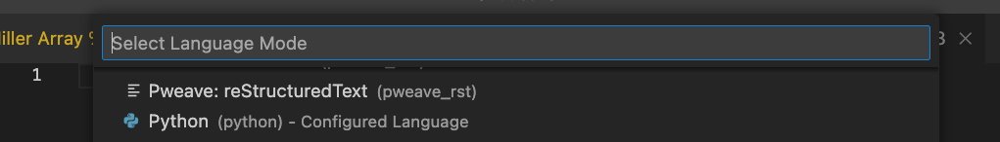
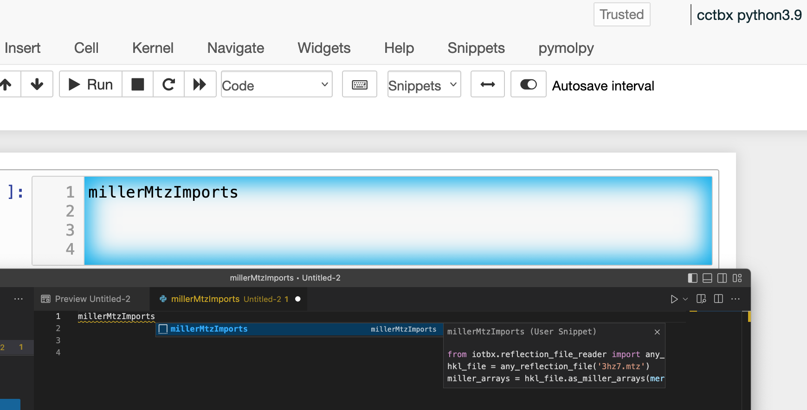
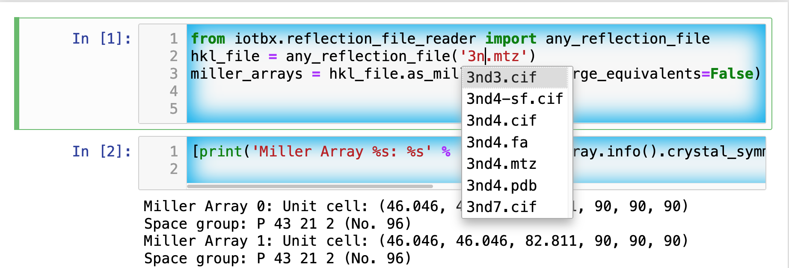

# cctbxsnips for Visual Studio Code (VSCode or VSC)

## CCTBX

[CCTBX](https://github.com/cctbx/cctbx_project) is the Computational Crystallography Toolbox. 
Its development is based at Lawrence-Berkeley National Laboratory.
It provides code for computations with diffraction data and atomic coordinates of proteins and small molecules.
It has C++ and Python ports.
It is available in Anaconda in the conda-forge channel as cctbx-base for python3.8 through 3.11 for Windows, macOS, and Linux.

### Blaine's cctbx install protocol

I assume that Anaconda has already been installed. We will create a conda env specifically for CCTBX. CCTBX has numerous dependencies. It is best kept in an isolated env. We also create the correpsonding Jupyter notebook kernel while we are at it. 

Execute one line at a time: Wait for the execution to finish before executing the next line.

```bash
conda create --name cctbx39 python=3.9
conda activate cctbx39
conda install -c conda-forge cctbx-base -y
conda install ipykernel -y
python -m ipykernel install --user --name cctbx39 --display-name "cctbx python3.9"
```

The second to last command triggers the installation of Jupyter in the cctbx39 env.
The last command creates and installs the Jupyter kernel in `~/Library/Jupyter/kernels/cctbx39` on the Mac.
Select **cctbx python3.9** from the list of kernels when opening a new notebook in Jupyter.

Replace the *3.9* or *39* above with whatever version of Python you want to use (between 3.8 and 3.11).


## The problems that this repo addresses

1. **Facilitation of code reuse**. The use of code snippets can save time by reusing existing code. The presence of tab stops in code snippets can help ensure that all parameters that need customization to a new problem are considered. Thus, tab stops can reduce subsequent debugging.

2. **Use of VSC to edit Jupyter and Colab code and markdown cells** The existnig snippet formats for Jupyter and Colab notebooks do not support tab triggers and tab stops: These are standard features of code snippet systems in most text editors. We can overcome these limitations by sending the active code cell to VSC via the GhostText extension for the browser.


## Installation

VSC has built-in support for snippets. The snippets are stored in a single JSON file by programming language.

1. Install the snippets for VSC.

From the above folder vscpymolsnips, download and move the file source.python.json on the macOS to `~/Library/Application\ Support/Code/User/snippets/python.json` ; on Windows to `$HOME/APPDATA\Roaming\Code\User\snippets\python.json`; on Linux to `$HOME/.config/Code/User/snippets/python.json`.
If you have an existing python.json, you want to concatenate the files.

2. **Optional** If you want to use these snippets from VSC to edit live cells in Jupyter or Colab notebooks, install [GhostText browser extension](https://ghosttext.fregante.com/) in your browser and the [GhostText extension for VSC](https://marketplace.visualstudio.com/items?itemName=tokoph.ghosttext). Open the command platte (Option-X on macOS) in VSC and enter "Enable GhostText".


## Example of VSCode editing a live code cell in a Jupyter notebook

*Note* After opening a connection from a code cell in a Jupyter Notebook (light-theme) to VSCode (dark-theme), a markdown document will appear in VSCode. You will need to manually change the scope to Python by opening the command palette (enter Option-X on macOS) and entering *Change Language Mode*. This will open a menu with a list of programming languages. Select **python**.  Now you will be able to access the cctbx snippets inside VSCode. 

<p align="center"></p>


However, each new cell activate with GhostText opens a new temporary document in VScode. The scope has to be changed again. This grows old fast. The default file extension of this temporary document is *.tmp. The tmp file extension can be remapped to python as follows in the **settings.json** file:

```javascript
"files.associations": {
    "*.tmp": "python"
},
```

The image below shows a popup menu with the selected snippet and preview of its code in VSC. 
This provides a chance to check that the snippet has the desired code.
Hit tab to insert the code.


<p align="center"></p>

The image below shows two code bloack that have been run in the Jupyter notebook.
Note that the output of a run code block is returned to the Jupyter notebook; however, the output does not appear in temporary document in VSC because the output is outside of the active text area of the Jupyter notebook.
In addition, the name of the mtz file is being changed.
While this is happending, Jupyter automaticallt returns a popup menu of candidate files.


<p align="center"></p>


## Related repositories

- [Jupyterlab cctbx snippets](https://github.com/MooersLab/jupyterlabcctbxsnips) CCTBX snippets for JupyterLab with the jupyterlab-snippets extension or the jupyterlab-snippets-mutlimenus extension.
- [Jupyterlab cctbx plus snippets](https://github.com/MooersLab/jupyterlabcctbxsnipsplus) The variant of the jupyterlabcctbxsnips library with comments to guide editing of the snippets.
- [Colab cctbx snippets](https://github.com/MooersLab/colabcctbxsnips) Colab snippets.
